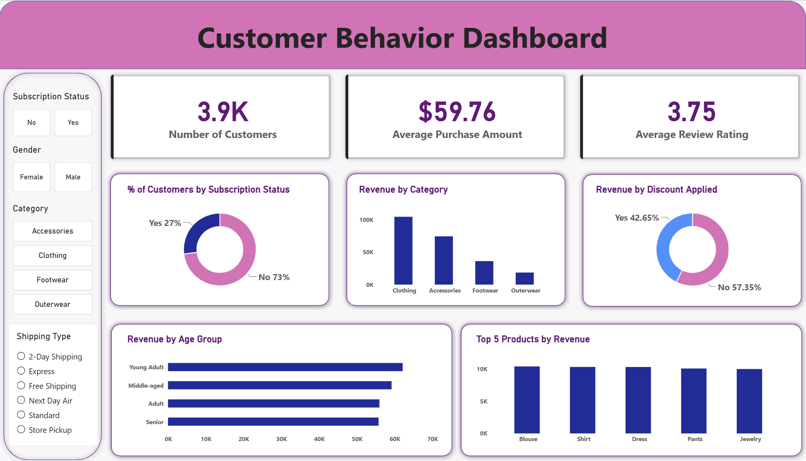

# Customer Shopping Behavior Analysis

## 📊 Project Overview

An end-to-end data analytics project analyzing customer shopping behavior, purchasing patterns, revenue drivers, discounts, subscriptions, product performance, and customer segments.

The project uses **Python, MySQL, SQL, and Power BI** to transform raw customer data into actionable business insights.

---

## 📸 Dashboard Preview



---

## Business Objectives
- Measure overall customer base, average purchase value, and average review rating.
- Compare revenue contribution across gender, categories, age groups, discount status, and subscription status.
- Identify high-performing products and product-level opportunities.
- Evaluate shipping preferences, discount usage, etc.

---

## 🛠️ Tools Used

- **Python / Pandas** – Data cleaning, EDA & feature engineering
- **MySQL – Business analysis and querying
- **Power BI** – Dashboard and data visualization
- **Jupyter Notebook** – Python analysis

---

## 🔄 Project Workflow

```text
Raw Dataset
     ↓
Python
     ↓
Data Cleaning & Feature Engineering
     ↓
SQL Business Analysis
     ↓
Power BI Dashboard
```

---

## 🐍 Python Analysis

Key data preparation steps included:

- Exploratory Data Analysis
- Missing-value treatment
- Column name standardization
- Age-group creation
- Purchase-frequency transformation
- Removal of redundant columns

---

## 🔎 SQL Analysis

10 business questions were answered using SQL, including:

- Male vs. female revenue
- Customers spending above average while using discounts
- Top 5 products by average rating
- Standard vs. Express shipping
- Subscriber vs. non-subscriber spending
- Products with the highest discounted-purchase percentage
- New / Returning / Loyal customer segmentation
- Top 3 products within each category
- Repeat buying vs. subscription status
- Revenue contribution by age group

---

## 📊 Power BI Dashboard

The dashboard provides an interactive view of customer behavior with:

### KPIs

- **Customers:** 3.9K
- **Average Purchase Amount:** $59.76
- **Average Review Rating:** 3.75

### Visuals

- Customer subscription status
- Revenue by category
- Revenue by discount status
- Revenue by age group
- Top 5 products by revenue

### Slicers

- Subscription Status
- Gender
- Category
- Shipping Type

---

## 💡 Key Insights

- **73%** of customers are non-subscribers, indicating an opportunity for subscription conversion.
- **Clothing** is the highest-revenue category.
- **42.65%** of purchase amount comes from discounted transactions.
- **Young Adults** contribute the highest revenue at approximately **$62K**.
- Customer segmentation provides a foundation for retention and loyalty strategies.

---

## 📌 Business Recommendations

- Focus on converting high-potential non-subscribers.
- Evaluate discount effectiveness at the product level.
- Continue investing in strong-performing categories such as Clothing.
- Use age groups and customer segments for targeted marketing.

---

## 📂 Project Files

| File | Description |
|---|---|
| `Customer_Shopping_Behaviour_Analysis.ipynb` | Python analysis |
| `Customer_Shopping_Behavior_Analysis.sql` | SQL queries |
| `Report.pdf` | Project report |
| `dashboard.pbix` | Power BI dashboard |
| `dashboard_image.png` | Dashboard image |
| `README.md` | Readme |

---

## 🏁 Conclusion

This project demonstrates an end-to-end analytics workflow using **Python, SQL, MySQL, and Power BI**. It converts raw customer shopping data into meaningful insights around customer behavior, revenue, products, discounts, subscriptions, and segmentation.
